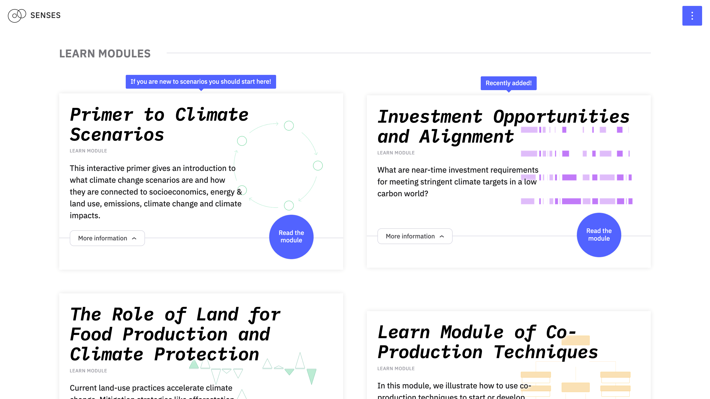

# Senses Toolkit

The Senses Toolkit offers a range of modules to learn about and explore climate change scenarios.

The website climatescenarios.org is an initiative of the EU project SENSES. The project investigates potential socioeconomic futures in the face of climate change and how this knowledge can be made accessible to a broader public.

SENSES will develop tools and approaches to make the new generation of climate change scenarios more comprehensible and accessible. Further information can be found on the project website: [senses-project.org](http://senses-project.org/)

## Senses Consortium
- Boris Müller
- Christoph Bertram
- Cornelia Auer
- Daniel Huppmann
- Elmar Kriegler
- Fidel Thomet
- Francesca Morini
- Henrik Carlsen
- Jan Volkholz
- Jonas Parnow
- Kasper Kok
- Lotte de Jong
- Michael Pimmer
- Nadia Zeissig
- Sara Talebian
- Simona Pedde
- Volker Krey

---

This repository contains the code for [*SENSES Toolkit*](https://climatescenarios.org/).





## License

The source code is licensed under the [ISC license](LICENSE.md). Text and graphics are licensed under [Attribution-ShareAlike 4.0 International](https://creativecommons.org/licenses/by-sa/4.0/).

## Build Setup

``` bash
# install dependencies
$ npm run install

# serve with hot reload at localhost:3000
$ npm run dev

# build for production and launch server
$ npm run build
$ npm run start

# generate static project
$ npm run build && npm run generate
```

## Deployment
- Build the code
- Upload to `/toolkit`
- Upload `index.html` to `/`
- Upload each page to `/`
- Upload background images to `/bg`
